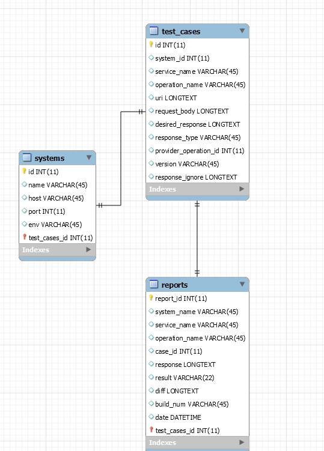
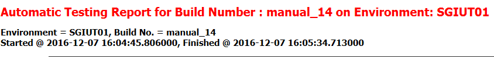
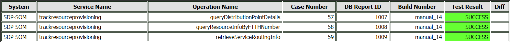
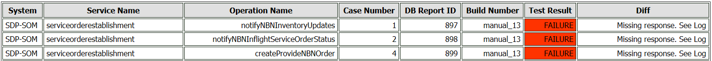
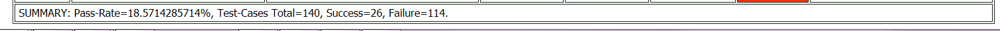

# Python Webservice Tester

# Overview

The Python Webservice Tester Application utilizes the Python scripting language to test webservice sanity. Testing the webservices is done by running a request response scenario and verifying that the response corresponds to an already validated response.

#### Prerequisites:

- MySQL DB
- Python compiler V2.7

# Application Resources

## Data Base

The application uses MySQL DB and can with small modifications utilize other DB. The DB contains 3 tables:

- TEST\_CASES table contains rows of test cases that contain the information required to test a Web-service operation as well as a _system\_id_ that correlates to a row in SYSTEMS table
- SYSTEMS table contains the Webserver details in order to execute a test case.
- REPORTS table contains the result details of executing a test case as well as _case\_id_ column that correlates to a row in the TEST\_CASES table.

## Executables

These methods are basically files containing a single &quot;main&quot; method that can be run via command line or invoked as inner methods from other Python methods/file.

##### TestEnvSanity(environmentName , buildNumber)

Selects all test cases associated with the Environment Name passed executes tests and generates report file which is sent via email

##### TestCase(caseID)

Executes test case with provided test case ID

##### UpdateDesiredResponseForEnv(environmentName)

This function will execute test cases and update the test cases&#39; desired responses. This is to be done when environment is configured and running properly so we can create a basis for future tests.

##### UpdateDesiredResponseForTestCase (caseID)

This function will execute a test case and update its desired response. This is to be done whenever there&#39;s a specific change and we know previous desired response needs to be updated.

## Utilities

### Configuration

_Config.py_ file holds the configuration details for the application:

#DB DETAILS
dbHost = &#39;localhost&#39;
dbPort = 1521
dbUser = &#39;root&#39;
dbPassword = &#39;admin&#39;
dbName = &#39;testschema&#39;

#EMAIL DETAILS
mailFrom = &quot;&quot;
mailTo =  &quot;&quot;
mailCC =  &quot;&quot;
mailServer = &quot;localhost&quot;

os = &#39;WIN&#39;

requestTimeout =4
app\_home = &#39;C:\bgazman\python_ws_tester&#39;

#HTTP ENDPOINT
httpHost = &#39;localhost&#39;
httpPort = &#39;4000&#39;

### Database Interaction

_DBHandler.py_ holds functionality for interaction with the database, it is responsible for:

- Opening and closing DB connections
- Executing _select_, _insert_ and _update_ SQL statements

- The SQL statements differ depending on which operating system application is deployed. Statement for appropriate env is determined by _os_ parameter in configuration file. _i.e_

**if** Config.os == &#39;WIN&#39;:
 cursor.execute(sqlSelectTestCase, [case\_id])
**else** :
 cursor.execute(sqlSelectTestCase, (case\_id))

### WebService invocation

_RequestResponseHandler.py_ contains a method _handleRequest()_ which receives the webservice URL and request xml document , it then calls the webservice and returns the xml response.

### Reporting

One of the main function the webservice tester is to generate a report of test execution to be sent via mail to recipients.

_ReportFileHandler.py_ is handles the report files:

- Report files are written into $APP\_HOME/Reports
- Report files are generated with name $BUILD\_NUMBER.html
- generateReportFile(buildNumber) selects rows from reports table in DB with provided build number and generates an html file with formatted table of test executions , the method then returns the name of the report file generated

### Emailing

_EmailHandler.py_ has a single method _sendEmail(buildNumber)_ that searches for a report file for a specific build and sends it to mail recipients in the configuration file. \*Multiple recipients should be comma delimeted in the configuration file.

### Logging

_LogHandler.py_ is responsible for formatting and writing the application logs:

- Logs are written into $APP\_HOME/Logs
- Log files rotation is 5MB

### XML Handling

_XMLHandler.py_ handles the manipulation of XML documents :

- _format\_xml()_ receives an xml string and a comma delimeted array of ignore elements
- Ignore elements are namespace + tag name of elements which content is to be deleted from xml. Inner method _deleteTags()_ is used

_DiffHandler.py_ compares two XML documents using _diff()_ method that compares the expected and actual xml and returns the differnce

### Exposing Application for Jenkins

The webserver tester is to be invoked whenever a build of the application is executed. In our case the Jenkins application is to call the python file _TestEnvSanity.py_ with the generated build number and desired environment to test. To call this file from Jenkins remotely was hard to achieve. Therefore HTTP endpoint is exposed.

_HTTPEndpoint.py_ exposes a URL that can be called by Jenkins as follows:

[_http://localhost:4000/?function=testEnvSanity&amp;env=X&amp;build\_num=Y_](http://localhost:4000/?function=testEnvSanity&amp;env=X&amp;build_num=Y)

# Test Execution Mechanism

The following flow describes how a single test case is being executed and the logic behind the steps. The flow is better demonstrated by breaking down the DB tables.

## Test Case Execution Flow

1. A request is generated:

1. test\_cases.request\_body is the payload
2. _test\_cases.operation\_name_ is the SOAP Action parameter
3. the address of request is the _systems.host_ +_systems.port_ + _test\_cases.uri_

1. Request is sent to websevice
2. Response from webservice is Handled :

1. The response XML document is cleared of contents for nodes that are present in _test\_casese.ignore\_elements_ (this elements are dynamic elements such as timestamps, GUID etc.)
2. Same formatting as above is done to the XML document in _test\_cases.desired\_response_
3. Both XML documents are compared and a diff between the two is generated
4. A row in _reports_ table is created , the row contains the ID of the test cases as well as a result column which can be Success of Failure depending on the generated diff in previous step

# Report File

## Report Header

## Report Table

The report table is all the rows in the reports table that correspond to the build number for the executed test.

The Test Result column is determined as follows:

1. SUCCESS
  1. There is no diff between the desired response and actual response
  2. The desired response is not set for the test case

- In this case &#39;No Expected Response&#39; will appear in the Diff column as a comment

1. FAILURE
  1. There is a difference between the desired response and actual response
  2. The response from webservice was not returned (HTTP 404 ERROR)

- &#39;Missing response. See Log&#39; will appear in the Diff column as a comment. Log will contain more information

## Report Footer

Contains a summary of the test executions

